# Predict, Manage and Monitor the call drops of cell towers using Cloud Pak for Data

> **Note**: This code pattern is part of a series that explores telecom call-drop predictions using IBM Cloud Pak for Data, Data Virtualization, Watson OpenScale, and Cognos Analyics. Other assets included in the series include:
>- Tutorial - [Query across distributed data sources as one: Data virtualization for data analytics](https://developer.ibm.com/tutorials/query-across-distributed-data-sources-as-one-data-virtualization-for-data-analytics/)
>- Code pattern - [Monitor your machine learning models using Watson OpenScale in IBM Cloud Pak for Data](https://developer.ibm.com/patterns/monitor-and-deploy-open-source-ml-models-with-wml-and-watson-openscale-on-icp4d/)
>- Tutorial - [Build dashboards in Cognos Analytics on IBM Cloud Pak for Data](https://developer.ibm.com/tutorials/build-dashboards-in-cognos-analytics-on-ibm-cloud-pak-for-data/)

A call drop is a situation where a call on a wireless network is disconnected before the caller ends the call. Some of the main reasons for call drops are:

* Inadequate coverage, which can be due to multiple reasons:

  * Lack of tower infrastructure
  * Improper network planning
  * Non-optimization of network

* Overloaded cell towers – the number of subscribers grow each day and most of them are on smartphones. The network capacity is simply not being ramped up at the same pace, which results in overloaded networks.

* Cityscape changes – there have been instances where newly-built multi-storied buildings cause adjacent building’s subscribers to lose cell reception. Such instances are very common with rapidly changing cityscapes and calls for routine network data analysis from service providers.

* Switching between towers – this situation occurs when a person is traveling or moving around while talking. Chances of a dropped call increaase if a call handover takes place (transfer from one base transceiver station (BTS) to another), especially in the case of overloaded networks.

* Technical failures – this is beyond anyone's control and operators generally monitor down-times through well-equipped network operation centers.

This code pattern aims to create a model to predict call drops, trained on the above mentioned failures. With the help of an interactive dashboard, we use a time series model to better understand call drops. As a benefit to telecom providers and their customers, it can be used to identify issues at an earlier stage, allowing more time to take the necessary measures to mitigate problems. The main features of the solution include:

* Built on IBM Cloud Pak for Data.
* Data can come from multiple db sources, for example an internal DB2 Warehouse (SMP) within the Cloud Pak for Data instance, or other external sources like DB2 on Cloud, Oracle db, Postgres Db, SingleStoreDB and so on. Data Virtualization will be used to integrate them all into one db source.
* Using a built-in notebook service, a time-series model that predicts call-drops in the the next 24 hours.
* A call-drop prediction model for each cell tower. These models will be monitored for quality and fairness using AI OpenScale.
* A Cognos Analytics dashboard that provides the user with an overall region-wise view of the call-drop scenarios. With the help of Watson OpenScale, the time-series model will be output in a graph, along with the models performance improvements.

After completing this code pattern, you'll learn how to:

* Use Data Virtualization.
* Create connections from Dbs hosted on multiple Cloud (AWS, Azure or IBM Cloud) or on-premise environments.
* Create views from joins and publish data to your current Project.
* Store custom models using open source technology on Watson Machine Learning.
* Deploy a model and connect the model deployment to Watson OpenScale on Cloud Pak for Data and IBM Cloud.
* Setup Model Fairness and Model Quality montiors in Watson OpenScale on Cloud Pak for Data, and on IBM Cloud, using a python notebook.
* Create a project and setup a python notebook on Cloud Pak for Data.

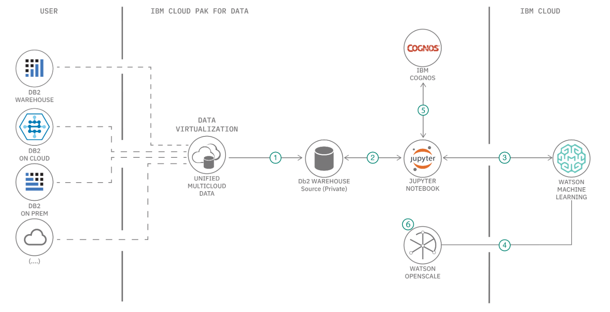

## Flow

1. Data stored across various sources, like AWS Cloud and IBM Cloud, are virtualized and joined as needed by the AI Models.
1. The joined data is stored back to the Internal Db(DB2 or SingleStoreDB) of Cloud Pak for Data and assigned to the current working project.
1. Create machine learning models using Jupyter Python Notebooks to predict call-drops per tower, and also a time-series model that projects a call-drop percentage based on real-time conditions.
1. Model trained and/or stored in Watson Machine Learning, which is also connected to the Watson OpenScale.
1. Visualize and analyse insights from the trained models and the data using Cognos Analytics dasboards.
1. Configure fairness, quality and explainability montiors for each tower's model.

## Featured technologies

* [Jupyter Notebooks](https://jupyter.org/): An open-source web application that allows you to create and share documents that contain live code, equations, visualizations, and explanatory text.
* [Pandas](https://pandas.pydata.org/):  An open source library providing high-performance, easy-to-use data structures and data analysis tools for the Python programming language.

## Prerequisites

* An [IBM Cloud Account](https://cloud.ibm.com).
* [IBM Cloud Pak for Data](https://www.ibm.com/in-en/products/cloud-pak-for-data)
* If DB2 is being used as the internal DB then you require 
[An Active DB2 instance](https://cloud.ibm.com/catalog/services/db2)
* If SingleStoreDB is being used as the internal DB then you require 
[An Active SingleStoreDB instance](https://docs.singlestore.com/v7.3/reference/memsql-operator-reference/additional-deployment-methods/helm-chart-for-ibm-cloud-pak-for-data/)
* [Watson OpenScale Add On for Cloud Pak for Data](https://cloud.ibm.com/docs/services/ai-openscale-icp?topic=ai-openscale-icp-inst-install-icp)
* Tutorial - [Query across distributed data sources as one: Data virtualization for data analytics](https://developer.ibm.com/tutorials/query-across-distributed-data-sources-as-one-data-virtualization-for-data-analytics/)
* Code pattern - [Monitor your machine learning models using Watson OpenScale in IBM Cloud Pak for Data](https://developer.ibm.com/patterns/monitor-and-deploy-open-source-ml-models-with-wml-and-watson-openscale-on-icp4d/)
* Tutorial - [Build dashboards in Cognos Analytics on IBM Cloud Pak for Data](https://developer.ibm.com/tutorials/build-dashboards-in-cognos-analytics-on-ibm-cloud-pak-for-data/)

> **Note**: As mentioned earlier, this code pattern is part of a series of assets around predicted call-drops from cell towers. It assumes that you have completed the other assets in the series (as listed above in the `Prerequisites` section). Those assets take you through some set-up steps that must be completed before starting on this code pattern.

## Steps

1. [Clone the repository](#1-clone-the-repository)
1. [Obtain your data from Data Virtualisation](#2-obtain-your-data-from-data-virtualisation)
1. [Create a new project in Cloud Pak for Data](#3-create-a-new-project-in-cloud-pak-for-data)
1. [Upload the dataset to Cloud Pak for Data](#4-upload-the-dataset-to-cloud-pak-for-data)
1. [Import notebook to Cloud Pak for Data](#5-import-notebook-to-cloud-pak-for-data)
1. [Follow the steps in the notebook](#6-follow-the-steps-in-the-notebook)
1. [Setup your notebook for call-drop monitoring](#7-setup-your-notebook-for-call-drop-monitoring)
1. [Setup Cognos Analytics Dashboard on your Cloud Pak for Data instance for visualizations](#8-setup-cognos-analytics-dashboard-on-your-cloud-pak-for-data-instance-for-visualizations)

### 1. Clone the repository

```bash
git clone https://github.com/IBM/icp4d-telco-manage-ml-project
cd icp4d-telco-manage-ml-project
```

### 2. Obtain your data from Data Virtualisation

To create the data set required for this code pattern, you have 2 options.

1. You can build the data yourself.

  * Follow the [Data Virtualization Tutorial](https://developer.ibm.com/tutorials/query-across-distributed-data-sources-as-one-data-virtualization-for-data-analytics/) to virtualize and join the data.
  * Select the `weather.csv` and `tower.csv` files as the two files to be joined and virtualized. Both files are located in the `/data` directory.

2. As a convinence, we have created a `csv` file version of this merged data wich you can use directly. The file is named `Telco_training_final.csv` and is also located in the `data` directory.

> **Note** : Pls execute the below section(`Steps for obtaining DB Credentials for DB2 on Cloud`) ONLY if you want to use DB2 on Cloud to store the output of the Time-Series model.

### Steps for obtaining DB Credentials

#### For DB2 on Cloud
* Create a [DB2 instance](https://cloud.ibm.com/catalog/services/db2) on your Cloud account.
* Once the instance is created, in the `Service Credential` tab, click on `Open Console`.

  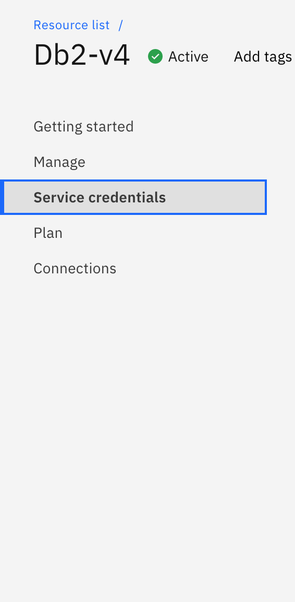
  
* Click on `New Credential` and the `Add`.

  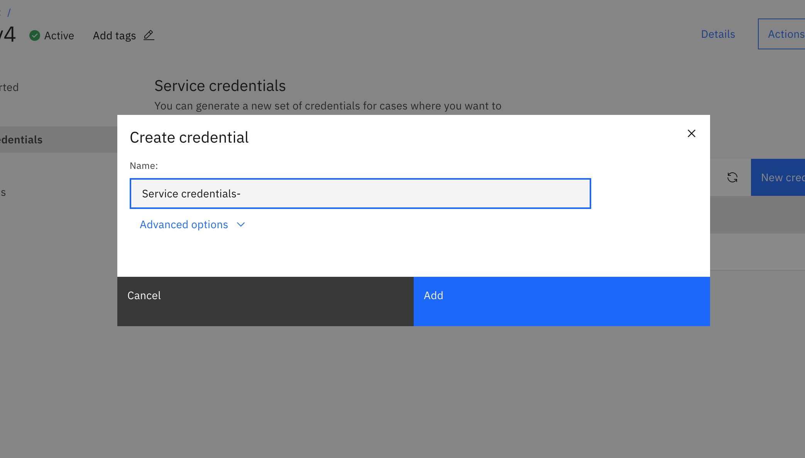

* Now the service credential will be created, click on the copy button and save the credentials.
 
  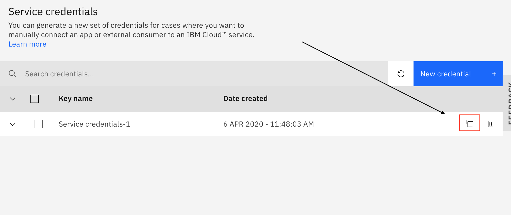

#### For SingleStoreDB
* The SingleStore database credentials are uid of admin and password is whatever you have used to launch cluster.
```
Example:  mysql -u admin -p<your admin pw> -h <cluster-ip> -P 3306
```


### 3. Create a new project in Cloud Pak for Data

* Once you login to your Cloud Pak for Data instance. Click on the (☰) `menu` icon in the top left corner of your screen and click `Projects`.

   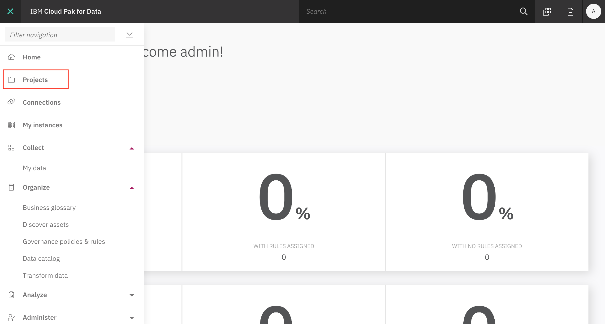

* When you reach the Project list, click on `New Project`. You will get a pop-up, make sure to have the `Analytics Project` option and enter the desired name. Once you click on `Ok` you will go to a new screen. Click on `Create` to complete your project creation.

   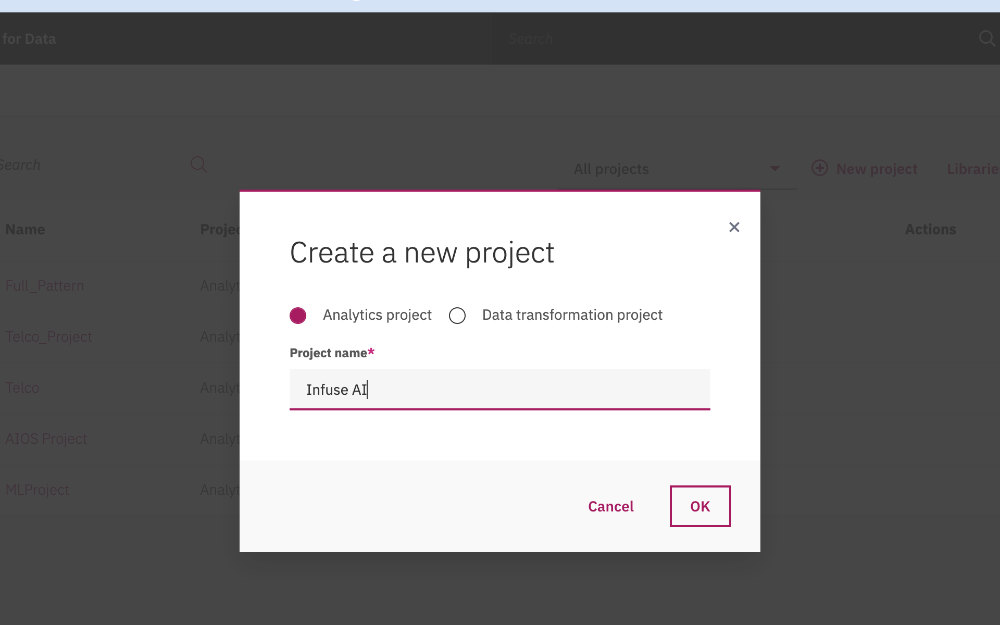

* Once the start-up page opens up. Click on `Add to Project` menu.
* Once the pop-up opens up click on `connection`.

   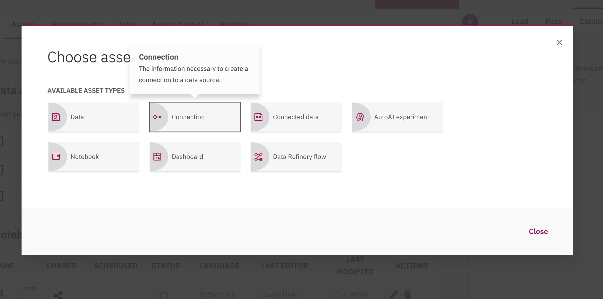
   
* Click on the appropriate Db option. And enter the saved credentials.

#### For DB2 Database, follow the below steps:

   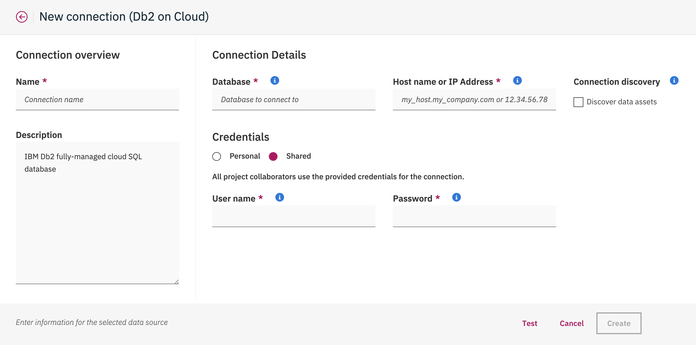

> **NOTE**: Click on Db2 on Cloud if you have did the `Steps for DB Credentials for Db2 on Cloud`. For any other db click other options and obtain the credentials.

* Click on `Test` and once it is succesful, click on `Create`.

#### For SingleStore database, follow the below steps:

* Select the `Compose for MySQL Database` connection.

  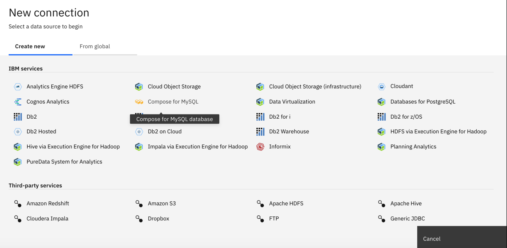  

* Enter the credentials of the Database. Click on `Test` and then click on `Create`.

  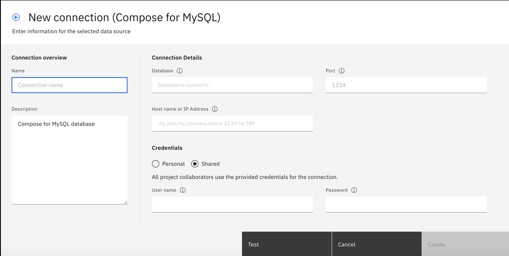

### 4. Upload the dataset to Cloud Pak for Data

* From your project page, click on `Data set > Add Data Set`. Select the `Telco_training_final.csv` file from the `/data` directory.

  

### 5. Import notebook to Cloud Pak for Data

* From your project page, select `Notebooks > Add Notebook`. From the `From URL` tab.  Enter the Notebook URL- https://github.com/IBM/icp4d-telco-manage-ml-project/blob/master/notebooks/Multivariate_Time_Series.ipynb, enter a name and click on `Create`.

   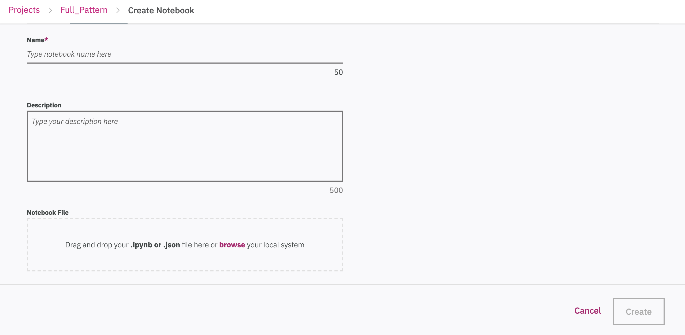

> **Note**: Choose the Python 3.6 environment.

### 6. Follow the steps in the notebook

You will run cells individually by highlighting each cell, then either click the `Run` button at the top of the notebook. While the cell is running, an asterisk (`[*]`) will show up to the left of the cell. When that cell has finished executing a sequential number will show up (i.e. `[17]`).

> **NOTE**: For reference, we have included a completed notebook in the `/examples` directory of this repo. This version of the notebook includes all the executed steps and outputs. See [https://github.com/IBM/icp4d-telco-manage-ml-project/blob/master/examples/Multivariate_Time_Series-Example.ipynb](https://github.com/IBM/icp4d-telco-manage-ml-project/blob/master/examples/Multivariate_Time_Series-Example.ipynb)


#### Configure in Notebook

Insert your created db credentials, below the section `2.1 Insert the Db Credentials` in the notebook. 

   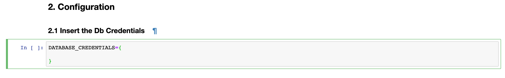


> **Note:** Run the below step (`Add the Dataset`) ONLY if you have not completed the [Data Virtulisation tutorial](https://developer.ibm.com/tutorials/query-across-distributed-data-sources-as-one-data-virtualization-for-data-analytics/). 

#### Add the Dataset

In section `2.2 Add Dataset`, highlight the blank cell by clicking on it. Click on the *10/01* button to select a specific data set.

Choose the `Local` tab, and select the `call_drop_data_train.csv` file that you added to the project. Under the `Insert to code` option, click `Insert Pandas DataFrame`.

  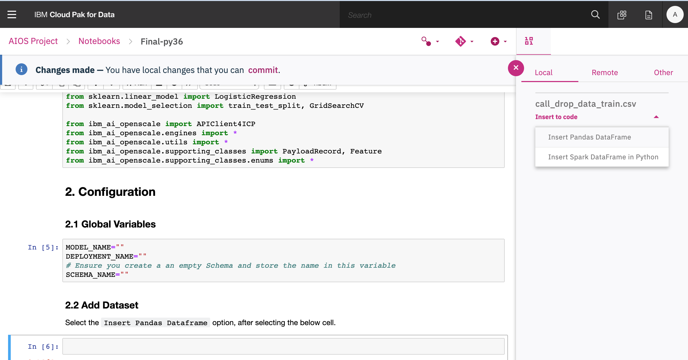

> **IMPORTANT**:  Ensure the variable name is set to `df_data_1`.

#### Run the notebook

* Go to the next-to-last cell in the notebook. Replace the schema name with an existing schema name from your DB.
* Run the notebook to completion by clicking on `Cell > Run all`.

### 7. Setup your notebook for call-drop monitoring

Complete the previous code pattern in this code series -
[Monitor your Open Source ML Models using Watson OpenScale](https://developer.ibm.com/patterns/monitor-and-deploy-open-source-ml-models-with-wml-and-watson-openscale-on-icp4d/).

It performs the setup of the deployments on Watson OpenScale.

### 8. Setup Cognos Analytics Dashboard on your Cloud Pak for Data instance for visualizations

Once data is generated and stored in the db., and after running the `Time Series` notebook, follow the tutorial - [Build dashboards in Cognos Analytics on IBM Cloud Pak for Data](https://developer.ibm.com/tutorials/build-dashboards-in-cognos-analytics-on-ibm-cloud-pak-for-data/) to generate the output as shown in the next section.

## Sample Output

A map based selection of each tower. When a tower is selected, the graphics indicate the call-drop prediction over the next 24 hours, with the help of the Time Series Model. It also shows which factors affect the call-drop percentage at the tower and by how much.

   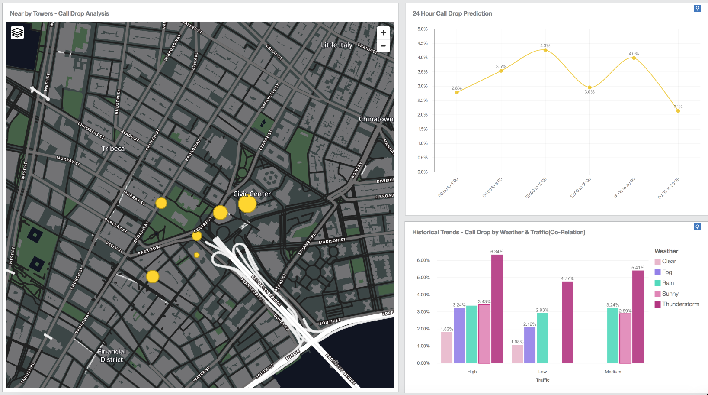

## License

This code pattern is licensed under the Apache License, Version 2. Separate third-party code objects invoked within this code pattern are licensed by their respective providers pursuant to their own separate licenses. Contributions are subject to the [Developer Certificate of Origin, Version 1.1](https://developercertificate.org/) and the [Apache License, Version 2](https://www.apache.org/licenses/LICENSE-2.0.txt).
