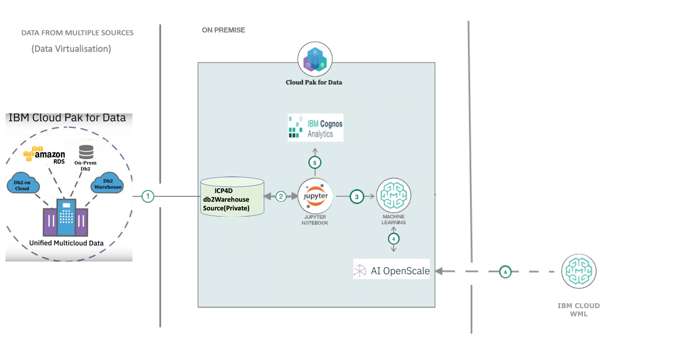

# Predict, Manage and Monitor the call drops of cell tower using Cloud Pack for Data

A call drop is a situation of disconnection of call before caller ends the call mostly on wireless networks. Some of the main reasons for Call-Drop are:

1. Inadequate coverage which can be due to multiple reasons
    * Lack of tower infrastructure
    * Improper network planning
    * Non-optimization of network

2. Overloaded cell towers – number of subscribers are growing day by day and most of them are on smartphones. The network capacity is simply not being ramped up at the same pace resulting in overloaded networks 
3. Cityscape changes – there have been instances where a new multistoried building comes up and the adjacent building’s subscribers lose cell reception. Such instances are very common with rapidly changing cityscapes and call for routine network data analysis from service providers.
4. Switching between towers – this situation occurs when a person is traveling or moving around while talking. If a call handover takes place from one BTS to another, especially in case of overloaded networks, there are chances of dropped calls.
5. Technical Failures – this is beyond anyone’s control and operators generally monitor downtimes through well-equipped network operation centers.

This Code Pattern Aims to Predict the Call Drop Prediction, trained on the above mentioned failures, so as to identify at an earlier stage and take necessary measures, with the help of an interactive dashboard (Embedded dashboard service
) that helps to understand the call drops with a Time Series Model. This will be benefit Telecomm Service to take the necessary action to improve the network coverage for their customers. The following are the main features of the solution-

* The solution will be built on IBM Cloud Pak for Data.
* Data maybe from multiple db sources, be it an internal Db2 Wh (SMP) within the Cloud Pak for Data instance or any external sources like Db2 on Cloud, Oracle db, Postgres Db and so on. Data Virtualisation will take place and all of them get integrated into one db source.
* A Time-Series Model that predicts next 24-hour call drop prediction using the built-in Notebook Service.
* A Call-Drop Prediction model for each cell tower, region-wise and these models monitored for quality and fairness using AI OpenScale.
* A Dashboard on Cognos Analytics will give a user an overall region-wise view of the call-drop scenarios, time-series model output in a graph and models performance improvement with the help of AI OpenScale.

After a user has completed this pattern they will learn how to-

1. Concept of Data Virtualization.
2. Create Connections from Dbs hosted on multiple Cloud (AWS, Azure or IBM Cloud) or On-Premise environments.
3. Create Views from joins and publish data to your current Project.
4. How to store custom models using open source technology on Watson Machine Learning.
5. How to deploy a model and connect the model deployment to Watson OpenScale on Cloud Pak for Data and on IBM Cloud.
6. How to setup Model Fairness and Model Quality montiors and Watson OpenScale on Cloud Pak for Data and on IBM Cloud, using      python notebook.
7. How to create a project and setup a python notebook on Cloud Pak for Data.


## Pre-requisites
* [IBM Cloud Pak for Data](https://www.ibm.com/in-en/products/cloud-pak-for-data) 
* [Data Virtualisation](Insert DV Tutorial)
* [Monitor your Open Source ML Models using Watson OpenScale](Insert code pattern link)
* [Monitor your Auto AI Models using Watson OpenScale](Insert Tutorial link)
* [Building Dashboards in Cognos Analytics on IBM Cloud Pak for Data](Insert Cognos Dashboard Tutorial)

```
Note: This Pattern is a 301 and will require you to completely setup with the help of the previous assets mentioned above. Hence, it is recommended you go over the previous assets before coming to setup this asset.
```

## Architecture Diagram

  
  
1. Data stored across various sources like, AWS Cloud, IBM Cloud is virtualised and joined as needed by the AI Models.
2. The joined data is stored back to the Internal Db of Cloud Pak for Data and Assigned to the current working project.
3. Create ML Models using Jupyter Python Notebooks to predict Call Drop, towerwise and also a Time Series Model that Projects a Call Drop % based real-time conditions.
4. Model trained and/or stored in Watson Machine Learning, which is also connected to the AI OpenScale.
5. Visualise and Analyse insights from the trained Models and the data using Cognos Analytics Dasboard. 
6. Configure Fairness, Quality and Explainability Montiors for each Tower's model, present within Cloud Pak for Data or on other external Clouds (Multi-Cloud Architecture).

## Steps

1. [Setup a new notebook on your Cloud Pak for Data instance](#2-setup-a-new-notebook-on-your-cloud-pak-for-data-instance)
2. [Setup notebook for Call Drop Monitoring Model](#3-setup-notebook-for-call-drop-monitoring-model)
3. [Setup Cognos Analytics Dashboard on your Cloud Pak for Data instance for Visualisations](#4-setup-cognos-analytics-dashboard-on-your-cloud-pak-for-data-instance-for-visualisations)


### 1. Setup a new notebook on your Cloud Pak for Data

* Create a new Project by clicking on the `Navigation Menu` icon in the top-left corner. Select on `Projects` tab.

   
   
* Click on `New Project>Analytics Project` and then select a name for your Project.

   
   
* Once you open your project, select `Notebook>Add Notebook`. From the `From File` tab, click on Browse. Navigate to the downloaded repo>notebooks. Select the `Time-Series.ipynb` notebook and click on `Create`.

   
   
* Insert your created db credentials, below the section `2.1 Insert the Db Credentials` in the notebook.

   
   
 #### Add the Dataset
 
   * Go back to your Project Landing Page. 
   * Clone this repo, by clicking on `Clone or Download`, unzip it and navigate to the `datasets` folder.
   * In your Project Page. Click on `Dataset>Add new Dataset> Browse`. Select the `Telco_training_final.csv` downloaded.
   
      

   * Now, open your notebook again and click on the cell under `Section 2.2 Add Dataset`.
   * Click on the `10/01` icon and select the `Insert to code` option. Under that select `Insert Pandas Dataframe` option.
   
      
      
* Go to the last cell in the notebook. Replace Schema Name with an existing Schema name.
* Now re-open the notebook. Click on `cell> Run all`. 

### 2. Setup your notebook for Call Drop Monitoring

   * Follow the steps of the above code pattern to setup the deployments on Watson OpenScale.
   [Monitor your Open Source ML Models using Watson OpenScale](Add link)
   
   
### 3. Setup Cognos Analytics Dashboard on your Cloud Pak for Data instance for Visualisations

   * Once data is generated and stored in the db. After running the Time Series Notebook, follow the tutorial-
   
   [Setup Cognos Analytics Dashboard on your Cloud Pak for Data instance for Visualisations](Add link) to complete the Sample Output.
   
## Sample Output

  *  A map based selection of each tower, on selection of one tower, it shows the call drop prediction over the next 24 hours, with the help of the Time Series Model. It also shows which factors affect the Call Drop Percentage at one tower and by how much?
  
   
    
  
